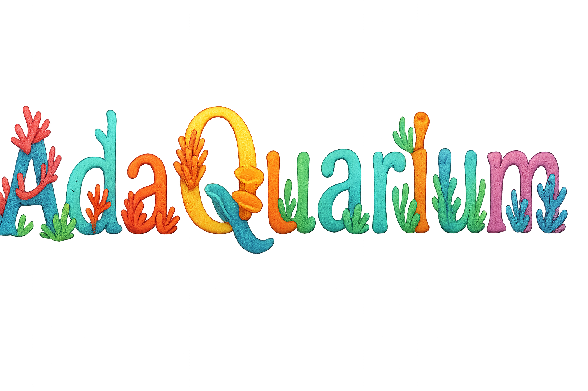

# Adaquarium

An interactive **Cardano blockchain visualizer** that turns on-chain activity into a living aquarium. Addresses area represented as animated sea life, making blockchain data approachable for **developers, educators, and newcomers**.

---

## Overview

Adaquarium connects to Cardano via **Blockfrost** and renders recent and historical chain activity as an animated scene. It’s designed to be a **developer tool for visualizing transactions** and a **fun, educational experience** for the broader community.

- **Fast updates** from recently completed blocks (configurable; defaults to a ~20-second lookback window).
- **Historical queries** for exploring past blocks and addresses.
- **No hard realtime/WebSocket requirement** — simple, reliable polling keeps ops light.

---
## Features

- **Recent Block Window**: Pull the latest completed blocks within a short window for a “near-live” effect.  
- **Historical Block Query**: Jump to any past block height or epoch/slot to replay activity.  
- **Transaction Logging**: Record and display transaction IDs from retrieved blocks.  
- **Native Currency Transfers**: Indicate the amount of ADA transferred in each transaction.  
- **Sender/Receiver Highlighting**: Show originating and receiving addresses for each transfer.

### Coming Soon
- **Search by Transaction ID**: Enter a tx hash to highlight and explain it in-scene.  
- **Search by Wallet Address**: Inspect recent activity and balance changes.  
- **Native Token Inventory (Visualization)**: Show counts and selected metadata for a wallet’s native assets.  
- **NFT Inventory (Visualization)**: Display owned NFTs (with icons/placeholders when media isn’t available).  
- **Toggleable Modes**: Switch between “developer detail” (labels, ids) and “clean” presentation (for demos/classes).  
- **Performance-friendly**: Polling cadence and page size are configurable to suit your hosting limits.
